# Assignmnent3
Name: Abdrakhmanova Aruzhan  
Group: IT-2501

This project implements and benchmarks three algorithms from different categories:

Basic - Insertion Sort
Advanced - Merge Sort
Search - Binary search
## Core Class Implementations
- ## Class 1

- ### Category A: Basic Sorting - Insertion sort

We need to take the second element and call it our key. We have to compare this key with all the numbers that are sitting to its left.

If the number on the left is bigger than our key, we just shift that larger number one position to the right using `arr[j + 1] = arr[j]`. We keep doing this as long as the numbers on the left are bigger or until we hit the start of the array.
Once we find the right spot (where the number on the left is smaller), we insert our key there. Then we move to the next element in the list and repeat the whole thing until everything is in the right order.

### Time Complexity:

| Case | Complexity |
|---|---|
| Best (sorted input) | O(n) |
| Average | O(n²) |
| Worst (reverse sorted) | O(n²) |

### Code:
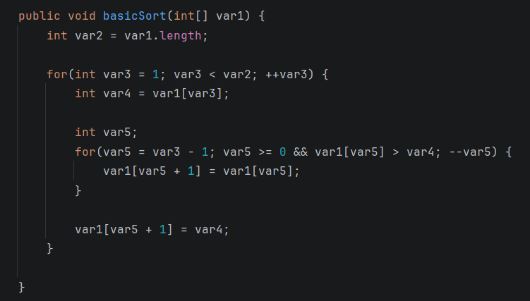

### Result:
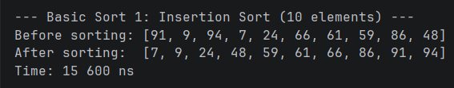

- ### Category B: Advanced Sorting - Merge Sort
The main idea here is to keep splitting the array in half until each sub-array has only one element.
First, we check the base case of our recursion. If the array has one element or less, it's already "sorted," so we just return. This is very similar to `if (n < 10)` check when we were printing digits.

Then, we find the middle of the array and call the same method recursively for the left half and the right half. We keep dividing and dividing until we reach the very bottom.

### Time Complexity:

| Case | Complexity |
|---|---|
| Best | O(n log n) |
| Average | O(n log n) |
| Worst | O(n log n) |

### Code:
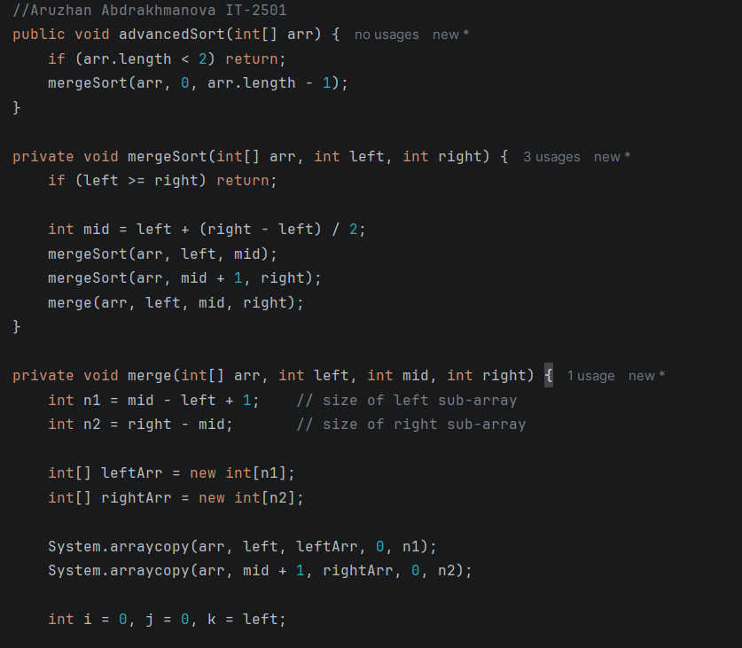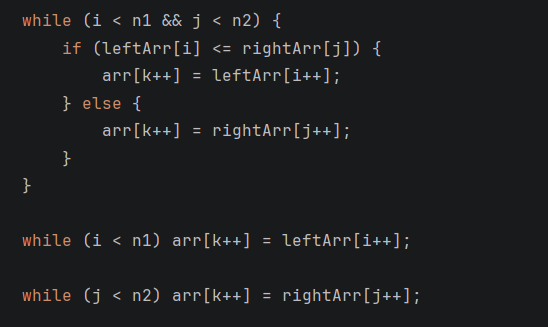

### Result:
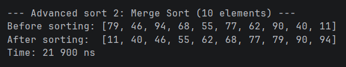

- ### PrintArray and RandomArray methods
The `printArray` method just loops through our array and prints all the numbers so we can see what's inside. The `generateRandomArray` 
method creates a new array of the size we want and fills it up with random numbers. We need this to test our algorithms on different amounts of data.
`int[] generateRandomArray(int size)` 
### Code:
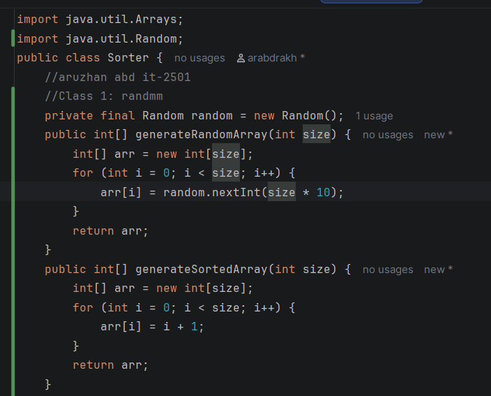
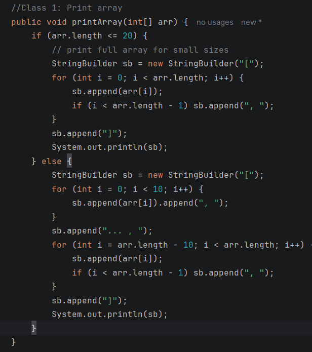

### Result: 
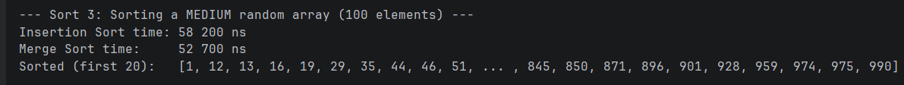
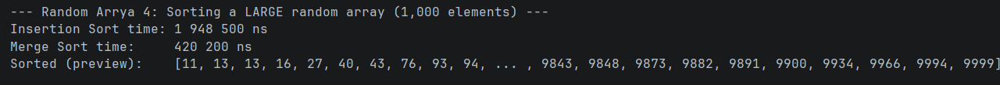
- ## Class 2
- ### Category C: Searching - Binary Search

We need to have a sorted array and set up two pointers: low at the very beginning and high at the very end. We use these to mark our search range.
Each step, we calculate the middle index `mid = (low + high) / 2`. This is how we divide the problem in half every time. If the number at arr[mid] is exactly our target, then we are done and just return that index.

If we haven't found it yet, we check the value:
If `arr[mid]` is smaller than the target, it means our number must be in the right half. So we move `low = mid + 1` to ignore the left side.
If `arr[mid]` is larger than the target, the number must be on the left. We move `high = mid - 1` to ignore the right side.
### Time Complexity:

| Case | Complexity |
|---|---|
| Best (middle element) | O(1) |
| Average | O(log n) |
| Worst | O(log n) |

### Code
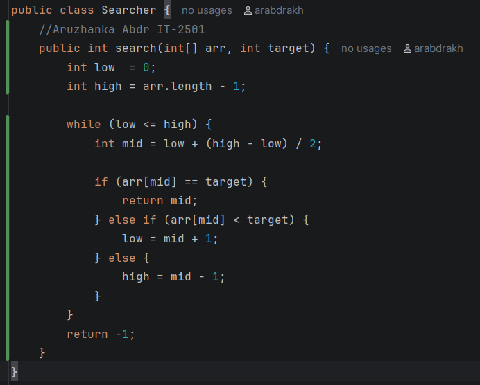

### Result: 
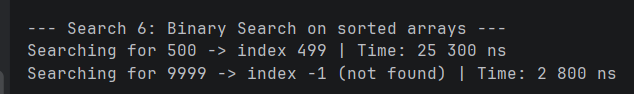
- ## Class 3
- ### Measure Sort Time
The `measureSortTime` and `measureSearchTime` methods help us figure out how fast our algorithms are. They work like a stopwatch: we use `System.nanoTime()` 
right before we start to get the start time, and then we check the time again right after we finish sorting or searching. The difference between those two times is how long our algorithm took to run.
### Code:
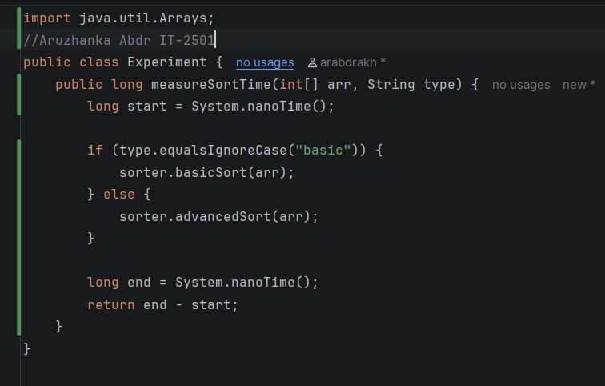
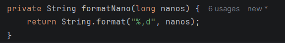

- ### Measure Search Time
The `measureSearchTime` method does the exact same thing but for our binary search. It measures exactly how many nanoseconds it takes to find the target number (or realize it's missing) by marking the time before and after the search.
### Code:
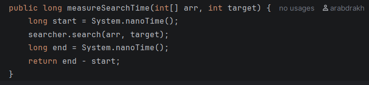

### Code:

- ### Run All Experiments:
The `runAllExperiments` method is our main tester. It creates arrays of different sizes (small, medium, large) and different states (random or sorted). Then it automatically runs all of our sorting and searching tools on them, measuring the time for each one and printing out a nice table so we don't have to test everything manually.

### Code:
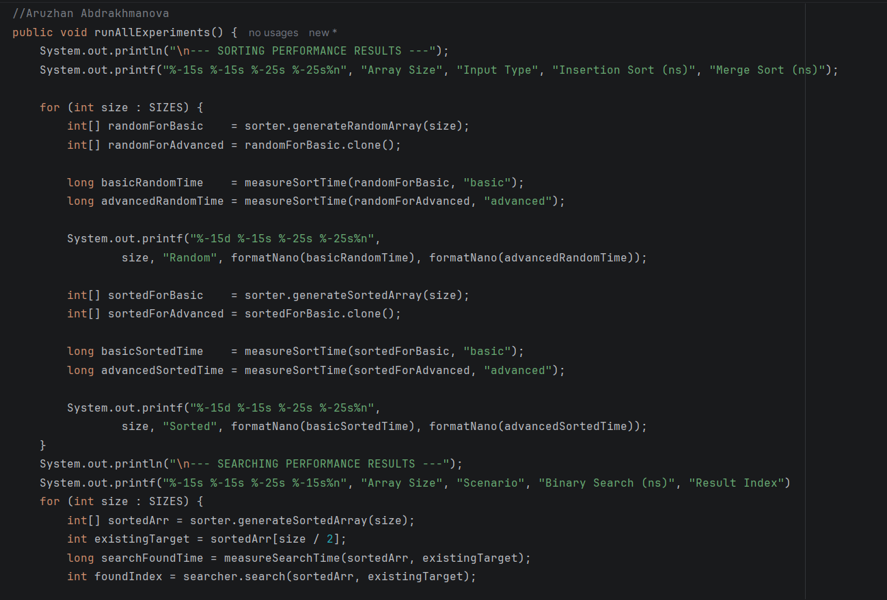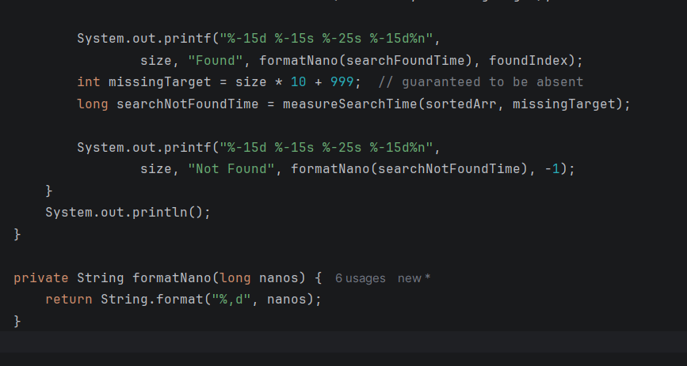
### Result:
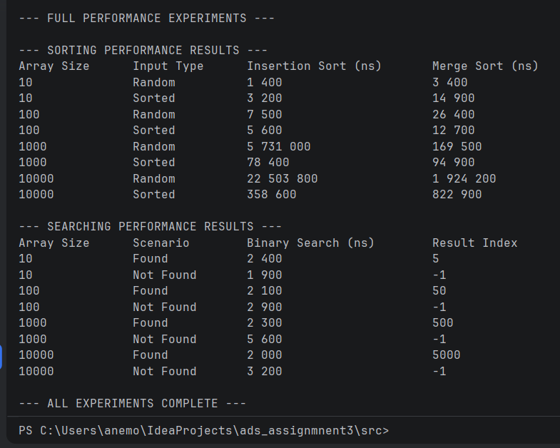

## Analysis Questions

**Which sorting algorithm performed faster? Why?**  
When we use random arrays with a lot of elements, Merge Sort is much faster because of its O(n log n) logic. But when the array is already sorted, Insertion Sort is faster because it just checks the numbers once and doesn't even need to swap anything.

**How does performance change with input size?**  
For Insertion sort, making the array bigger makes it take way more time O(n^2). For Merge Sort, the time increases much more slowly and steadily.

**How does sorted vs unsorted data affect performance?**  
Insertion sort loves sorted data runs in O(n) which is its best case. Unsorted data is much slower. Merge Sort works practically the same whether the data is sorted or not.

**Do the results match the expected Big-O complexity?**  
Yes, insertion sort gets really slow on big random arrays O(n^2), but stays fast on sorted ones. Merge sort shows steady O(n log n) growth, and Binary Search is super fast and almost constant since it's O(log n).

**Which searching algorithm is more efficient? Why?**  
Binary search is more efficient compared to a regular linear search. With 10,000 items, instead of checking all of them, it only needs to divide the array in half about 14 times.

**Why does Binary Search require a sorted array?**  
Binary search decides to go left or right based on whether the middle number is bigger or smaller than the target. If the numbers are randomly placed, this trick won't work because bigger or smaller numbers could be anywhere.

## Sorting performance
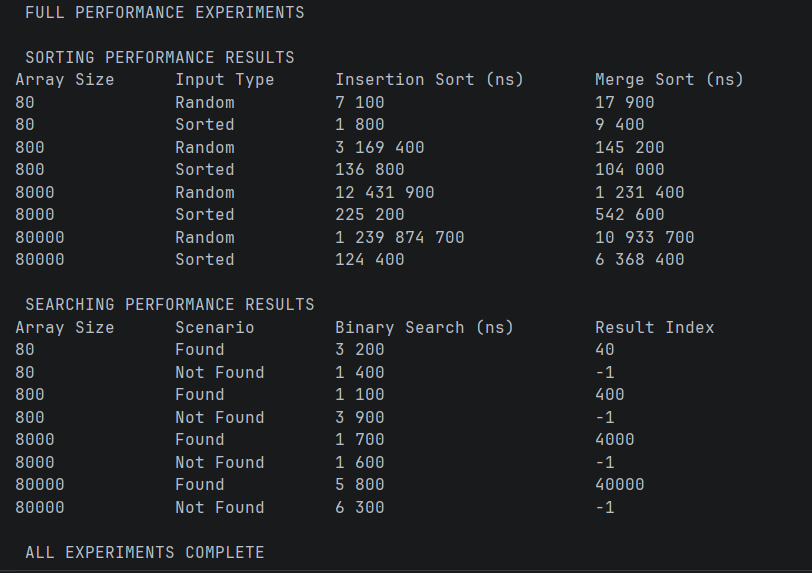

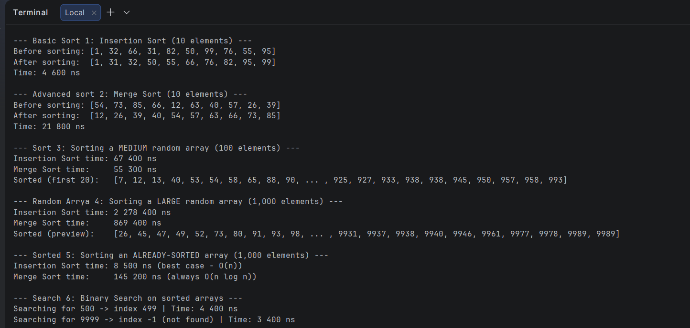
## Screenshots
Screenshots provided before and in docs directory.

## Summary
Working on this assignment taught me a lot about algorithm efficiency. Before this, O(n^2) and O(n log n) were 
just math formulas from lectures, but seeing Merge Sort easily beat Insertion Sort on large arrays really showed me why choosing the right algorithm 
is so important. I also learned that theoretical best-case scenarios actually happen. I saw that insertion sort runs 
almost instantly on a sorted list, which proved that even "slower" algorithms can sometimes be the best choice for specific situations.The main challenge I faced was measuring 
the time properly. I used System.nanoTime(), but it can be a bit tricky because measuring tiny bits of time can jump around due to things happening in the background of the computer. So a 
few results looked weird on very small arrays until I got the hang of it. But overall, bringing these algorithms into code and matching them up with theory was super interesting. I used these tests to see how the 
time changes step by step and it really helped me understand the logic.
